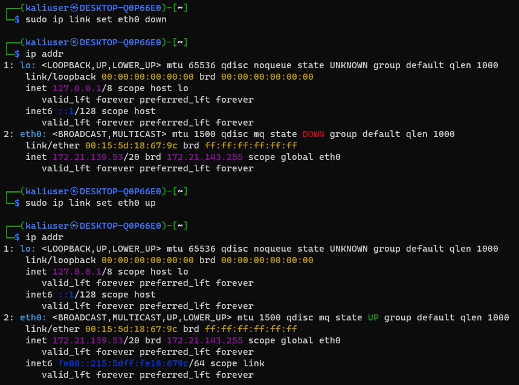

# 기본 리눅스 명령어

### cp, 파일 및 디렉토리 복사

> \# 하위 디렉토리를 포함한 디렉토리 생성 \
> $ mkdir -p test/subdir

> \# -r 옵션을 이용하여 디렉토리 복사 \
> $ cp -r test test2


### find, 파일 및 디렉토리 검색

* 명령어 형식 : find <경로> <검색 옵션> <동작>
* 검색 옵션
  * -name <파일명>
  * -type <파일 종류>
* 동작
  * -print : 파일 경로 출력
  * -ls : 검색 결과 목록 출력
  * -exec <명령> : 검색된 파일에 명령을 실행

> \# '/' 내에 있는 test_move라는 이름의 파일을 검색하여 출력하는 명령 \
> $ sudo find / -name 'test_move' -print


### du & df, 파일 및 디렉토리 용량 확인

* du : disk usage, 특정 파일과 디렉터리의 용량을 표시
* 옵션
  * -s(sum, 합계 표시)
  * -h(easier to human, 읽기 쉬운 형태로 표시)
  * -sh : 동시 활용
---
* df : 현재 사용중인 디스크와 파일 시스템의 전체 용량 및 여유 공간을 표시
* 옵션
  * -k(KB 단위 표시)
  * -h(KB, MB, GB 단위 표시)


### tar, 파일 및 디렉토리의 압축(몪기)과 해제

* tar : 파일을 묶는 명령어. 파일과 디렉토리를 묶고 압축할 때 기존 파일의 속성과 디렉토리 구조등을 그대로 가져갈 수 있기 때문에 보편적으로 사용함.
* 옵션
  * 압축하기 : -z(gzip 압축), -j(bzip 압축)
  * 묶기와 해제
    * -c (파일 생성, 묶기)
    * -f (대상 지정)
    * -v (처리되는 과정 표시)
    * -x (파일 압축 해제제)


### 사용자 및 파일 권한 관리 명령어
|-|r w x|r w x|r w x|
|-|-|-|-|
|파일형식<br>(1번째)|사용자(user)권한<br>(2~4)번째|그룹(group)권한<br>(5~7번째)|기타사용자권한<br>(8~10번째)|
|-:파일<br>d:디렉토리<br>s:소켓파일|r:읽기권한<br>w:쓰기권한<br>x:실행권한|r:읽기권한<br>w:쓰기권한<br>x:실행권한|r:읽기권한<br>w:쓰기권한<br>x:실행권한|

|종류|파일|디렉토리|
|-|-|-|
|r(읽기권한)|파일 읽기, 복사(cp 명령어) 가능| ls 명령어로 디렉토리 내 목록 조회 가능|
|w(쓰기권한)|파일 수정, 이동, 삭제 가능<br>(rm명령어, mv명령어 가능)|디렉토리 내 파일을 생성, 삭제 가능|
|x(실행권한)|파일 실행 가능(실행파일, 쉘 스크립트)| cd 명령어로 디렉토리 접근 가능<br>(읽기 권한이 없다면 ls는 불가)|

|유형|설명|소유자 변경 명령어|
|-|-|-|
|사용자|파일의 소유자|chown|
|그룹|해당 파일의 그룹 정보|chgrp|
|기타 사용자|소유자, 그룹에 속하지 않는 모든 사용자||

* whoami : 현재 사용자 확인
* adduser/useradd : 사용자 추가
  * -d : 홈 디렉토리 변경(기본 값에서 변경하면서 사용자 생성)
  * -g <그룹 ID> or -G <그룹명> : 그룹 설정
* userdel : 사용자 삭제
* usermod : 사용자 속성 변경
  * -d : 홈 디렉토리 변경
  * -g <그룹 ID> or -G <그룹명> : 그룹 변경
  * -p : 패스워드 변경
* chmod : 파일 권한 변경
  * [ugoa][-+=][rwx] 파일명
    * u : 사용자권한, g : 그룹 권한, o : 기타 권한, a : 모두
  ```bash
    $ chmod a-w copy2.txt # 모든 사용자에게서 쓰기 권한을 제거한다.
  ```
  * [1-7|1-7|1-7] 파일명
    * 1 : x, 2 : w, 4 : r
    * rwx : 111
    * 각 사용자 유형마다 해당하는 조건의 값을 더해서 표시하면 된다.
  ```bash
    $ chmod 666 copy2.txt # 모든 사용자에게 w와 r의 권한을 부여한다. (w + r : 2 + 4 = 6)
  ```
* chown : 파일 소유권 변경
  ```bash
    $ sudo chown root copy2.txt
  ```
* chgrp : 파일 그룹 변경
  ```bash
    $ sudo chgrp root copy2.txt
  ```
* umask : 초기 파일 접근 권한 설정 (666(파일 최대 권한)과 마스크 정보(ex:022)의 xor 연산 값이 파일 생성할 때 초기 권한 값이 됨)


### 네트워크 관리 명령어
* 네트워크 툴 설치
```bash
  $ sudo apt install -y net-tools
```
* ifconfig
  * ifconfig <네트워크 이름> up / down : 네트워크 활성화 / 비활성화
  ```bash
  $ ifconfig # 현재 활성화된 네트워크 인터페이스 표시
  $ sudo ifconfig eth0 down # eth0 인터페이스 비활성화
  $ ifconfig # eth0 보이지 않음. 
  $ ifconfig -a # eth0 보임 (모든 인터페이스 표시)
  $ sudo ifconfig eth0 up # eth0 인터페이스 활성화
  ```
  * 최근에는 ifconfig 명령어를 대체하는 ip 명령어를 사용하기도 한다.
  * ifconfig ===> ip addr
  * ifconfig [네트워크 이름] [up / down] ===> ip link set [네트워크 이름] [up / down]


* netstate : 네트워크 접속 정보 확인
  * -a : 전체 접속 정보 출력
  * -n : TCP 연결 정보 확인
  * -r : 라우팅 테이블 정보 출력
* route : 라우팅 테이블 확인 및 설정


### 서비스 관리 명령어
* systemctl, 서비스 관리
  * 주로 관리자 권한으로 실행 (sudo)
  * systemctl start/stop/restart <서비스명> : 서비스 실행/중단/재시작
  * systemctl status <서비스명> : 서비스 상태 확인
  * systemctl enable / disable <서비스명> : 부팅 시 서비스 자동 시작/중지


